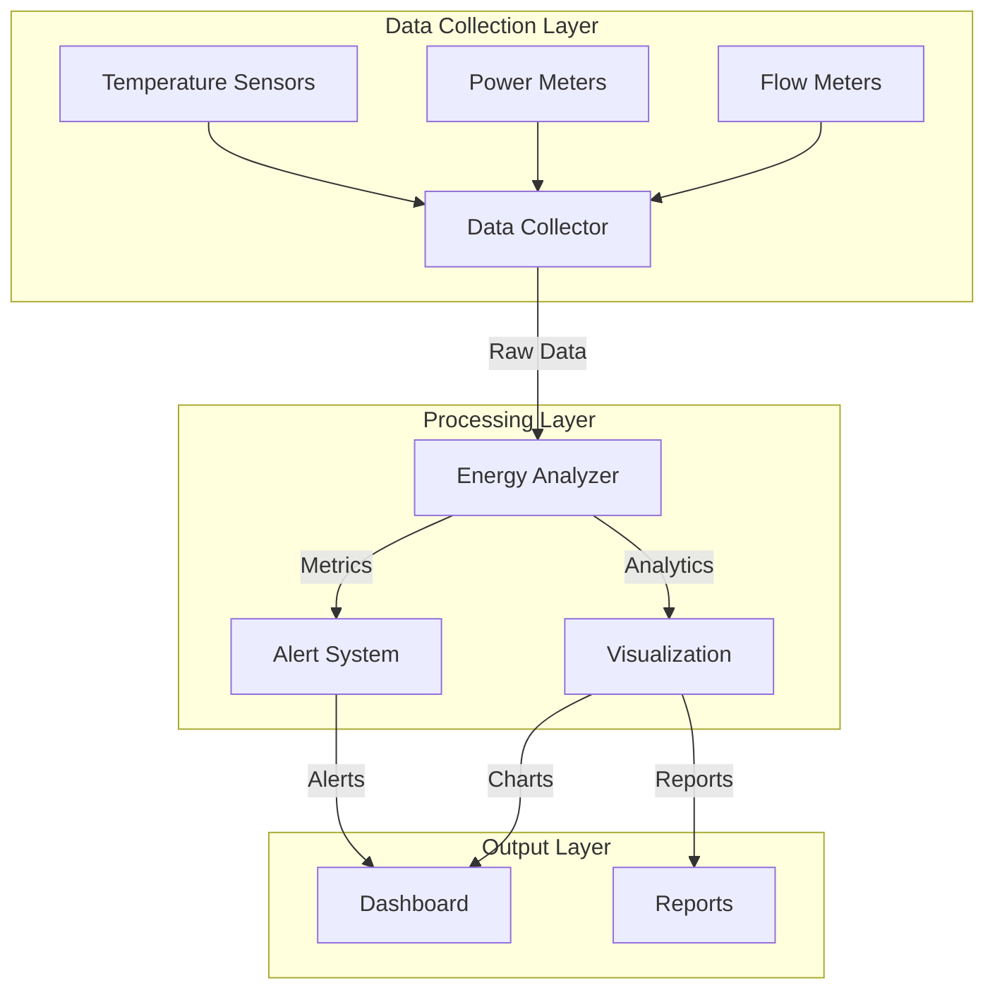
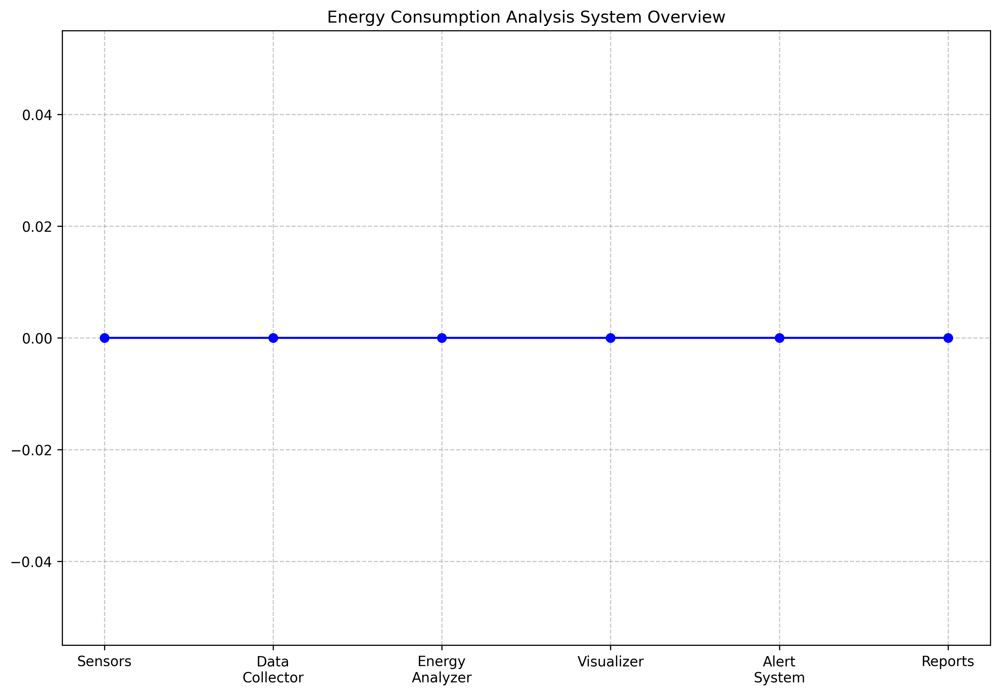

# Energy Consumption Analysis System 🏭

[](https://www.python.org/downloads/)
[](LICENSE)
[](https://github.com/rushiiu07/Energy-Consumption-Analysis-System/graphs/commit-activity)

## 📊 System Overview

This system provides comprehensive energy consumption monitoring and analysis for petrochemical plants. It features real-time data collection, advanced analytics, and automated reporting.

### Architecture Overview



For detailed architectural documentation, please see [Architecture Documentation](docs/architecture/ARCHITECTURE.md)

A comprehensive system for monitoring and analyzing energy consumption in petrochemical plants, providing real-time analytics, alerts, and daily reports.

<div align="center">
  
</div>

## System Requirements

- Python 3.8 or higher
- Windows/Linux/MacOS
- 2GB RAM minimum
- Internet connection (for package installation)

## Project Structure

```
energy_consumption_analysis/
│
├── config.py              # Configuration settings
├── data_collector.py      # Data collection from sensors
├── energy_analyzer.py     # Data processing and analysis
├── visualizer.py         # Data visualization
├── main.py               # Main application
├── requirements.txt      # Python dependencies
└── reports/             # Generated reports and visualizations
```

## Installation Instructions

1. Clone or download the project to your local machine

2. Open a terminal/command prompt and navigate to the project directory:
   ```bash
   cd path/to/energy_consumption_analysis
   ```

3. Create a Python virtual environment:
   ```bash
   # Windows
   python -m venv venv
   
   # Linux/MacOS
   python3 -m venv venv
   ```

4. Activate the virtual environment:
   ```bash
   # Windows
   .\venv\Scripts\activate
   
   # Linux/MacOS
   source venv/bin/activate
   ```

5. Install required packages:
   ```bash
   pip install -r requirements.txt
   ```

## Configuration

Before running the system, review and update the settings in `config.py`:

1. Database Configuration:
   - Update database credentials
   - Modify connection settings if needed

2. Sensor Configuration:
   - Adjust data collection interval (default: 300 seconds)
   - Configure sensor IDs and types

3. Alert Thresholds:
   - Set power consumption threshold
   - Configure temperature limits
   - Adjust efficiency thresholds

4. Reporting Configuration:
   - Set report generation frequency
   - Update email recipients
   - Choose report format

## Running the System

1. Ensure your virtual environment is activated

2. Start the main application:
   ```bash
   python main.py
   ```

The system will:
- Start collecting data from configured sensors
- Process and analyze the data in real-time
- Generate alerts for threshold violations
- Create daily reports with visualizations

## Available Features

1. Real-time Monitoring:
   - Power consumption tracking
   - Temperature monitoring
   - Flow rate measurement
   - Efficiency calculation

2. Automated Alerts:
   - High power consumption
   - Temperature threshold violations
   - Low efficiency warnings

3. Data Visualization:
   - Power consumption trends
   - Efficiency analysis
   - Temperature correlations
   - Daily summary charts

4. Reporting:
   - Daily summary reports
   - Energy consumption statistics
   - Cost analysis
   - Performance metrics

## Running Individual Components

You can also run each component separately for testing or development:

1. Test data collection:
   ```bash
   python data_collector.py
   ```

2. Test data analysis:
   ```bash
   python energy_analyzer.py
   ```

3. Test visualization:
   ```bash
   python visualizer.py
   ```

## Output Files

The system generates several types of output files in the `reports` directory:

1. Daily Reports:
   - `daily_summary_YYYYMMDD.csv`: Numerical data summary
   - `power_consumption_YYYYMMDD.png`: Power consumption graphs
   - `efficiency_trends_YYYYMMDD.png`: Efficiency analysis charts

## Troubleshooting

1. If you encounter import errors:
   - Verify that your virtual environment is activated
   - Confirm all requirements are installed: `pip list`
   - Try reinstalling requirements: `pip install -r requirements.txt`

2. If data collection fails:
   - Check sensor configuration in `config.py`
   - Verify network connectivity (for real sensors)
   - Check permissions and access rights

3. If visualizations don't appear:
   - Verify matplotlib installation
   - Check if the reports directory exists
   - Ensure write permissions for the reports directory

## Support

For additional support or questions:
1. Check the documentation in each module
2. Review the code comments for detailed explanations
3. Contact the system administrator for access issues

## Future Enhancements

Planned features for future releases:
1. Real sensor integration
2. Machine learning predictions
3. Web dashboard interface
4. Mobile alerts
5. Extended reporting options