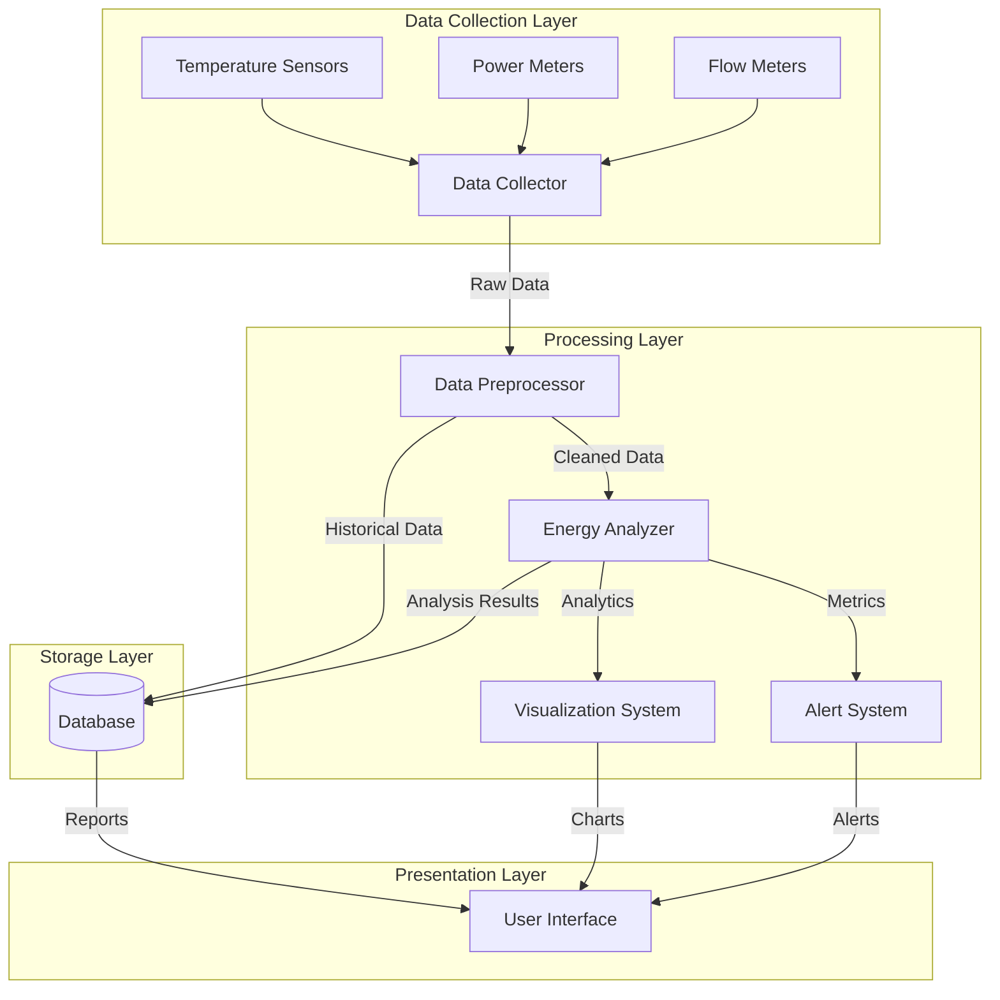
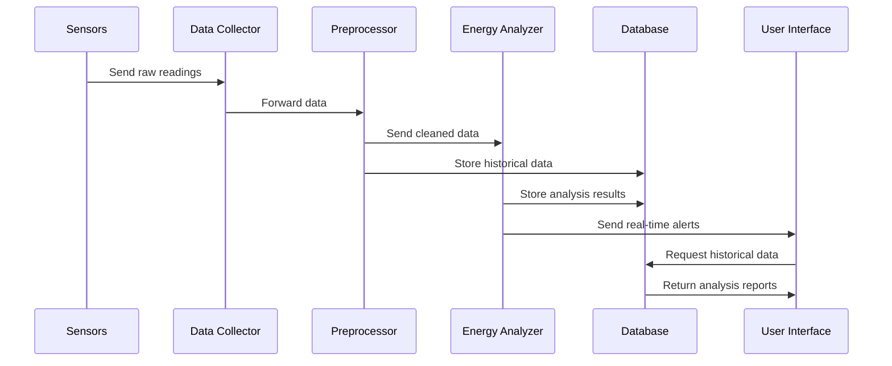
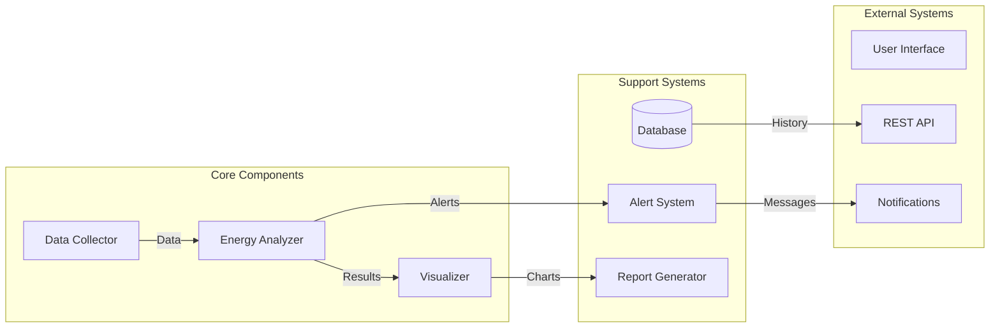
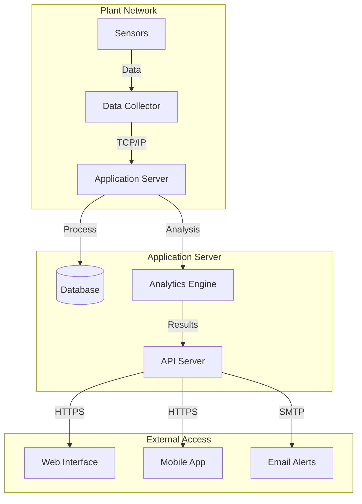
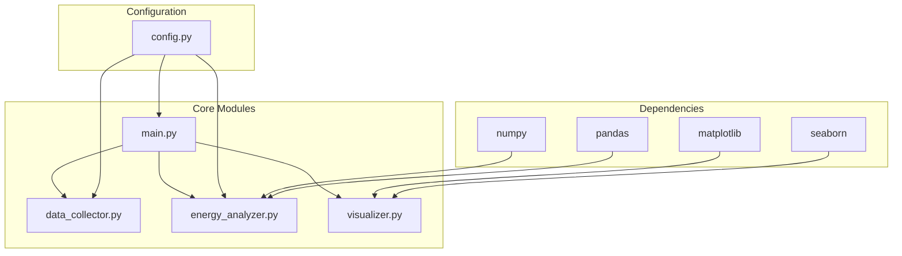
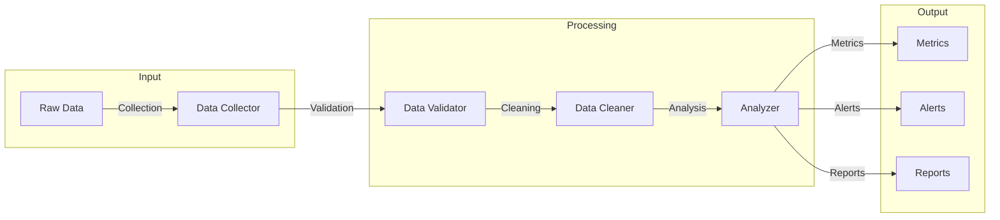
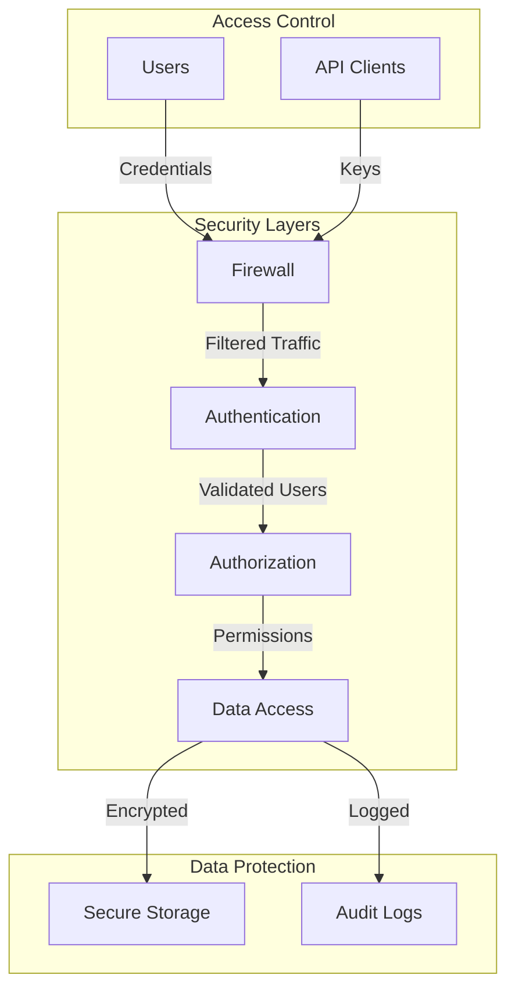

# System Architecture Documentation

## High-Level Architecture

## Technical Stack

### Backend Components
- **Data Collection**: Python scripts for sensor data acquisition
- **Data Processing**: NumPy and Pandas for data manipulation
- **Analysis Engine**: Custom analytics modules
- **Storage**: Local/Remote database system

### Frontend Components
- **Visualization**: Matplotlib and Seaborn
- **Reporting**: Automated PDF generation
- **Monitoring**: Real-time dashboard

## Data Flow Diagram

## Component Interaction

## Deployment Architecture

## Module Dependencies

## Data Processing Pipeline

## System Components Detail

### Data Collection Layer
- Temperature Sensors
- Power Meters
- Flow Meters
- Data Aggregator
- Validation System

### Processing Layer
- Data Preprocessor
- Energy Analyzer
- Alert System
- Visualization Engine

### Storage Layer
- Time-series Database
- Analytics Storage
- Report Archive
- Configuration Store

### Presentation Layer
- Web Dashboard
- Mobile Interface
- Email Notifications
- API Endpoints

## Security Architecture

